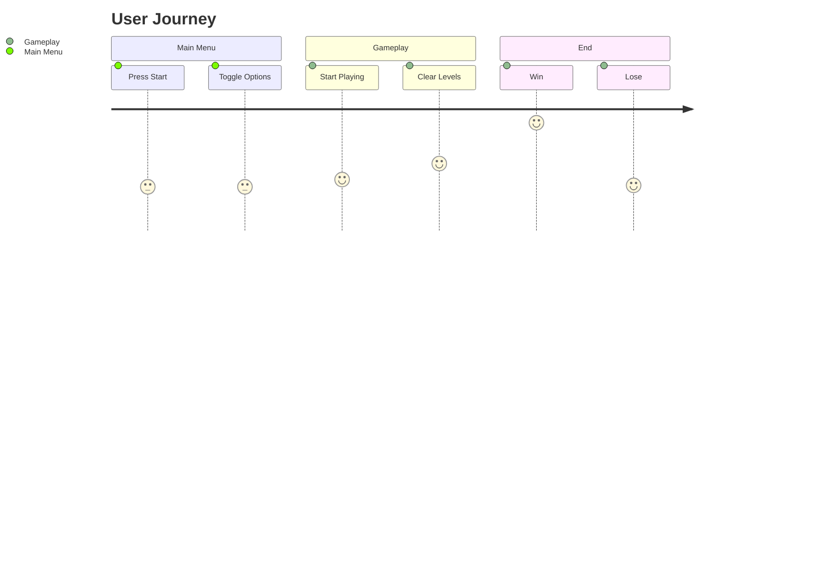
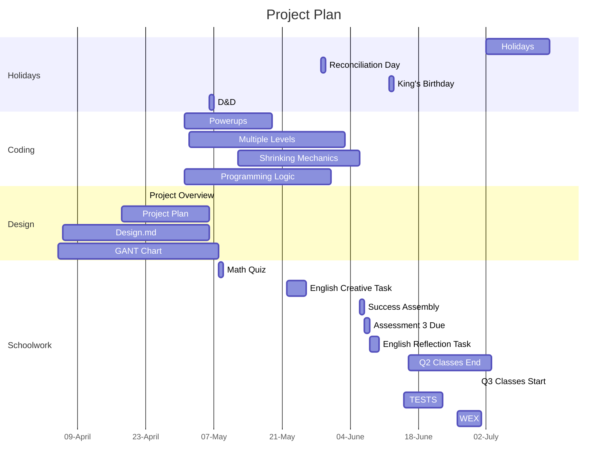

# Project Overview

This game is a clone of the popular game; Space Invaders. The theme of this game is low-quality. There's something appealing about playing something so stupid and low-effort. The entire mobile ad space is currently full of these sort of ads, which seem to be working given this trend's longetivity. I thought I could try to replicate this effect with the graphics.

## The Graphics
Some of these examples of "low effort" graphics include a child's drawing of a rocket as the player sprite and PNGs of aliens digitally modified to make them look low-effort, which ironically took a substantial amount of time.

 

The enemy sprite (left) and the player sprite (right).

## New Gameplay
The additional gameplay that is being included is a shrinking mechanic, a dash mechanic and  multiple levels. It is my hope that this creates a varied and interesting experience for the player, making no two run-throughs of the game the same.
I also hope that this will make the player feel like they have a good amount of tools in order to avoid enemy attacks.

### Multiple levels
There will hopefully be a variety of levels, which helps to give the player a sense of progress as they play through Invade Spacers. This will also make sure that the game isn't incredibly short.

### Dash Mechanic
I feel like a mechanic which lets a player dash could be a very interesting way to avoid enemy attacks. It'll have a pay-off, forcing the players to rush headfirst to another place on the screen, possibly into another enemy bullet.
It'll also be super quick, making it a 

### Shrinking Mechanic
I think a mechanic where the player can temporarily shrink themselves (more importantly, their collision shape) in order to avoid enemy attacks could work well. The caveat to this will be that their bullets shrink with them, making it harder to hit enemies in this state. 
Additionally, if they die while shrunk, their bullets will remain small when they respawn until they can shrink again and survive until they grow again.
This mechanic is inspired by Cuphead.

### Slow Bullets
I have decided to make the bulelts be fairly slow to promote accuracy over barraging. It will also help the game be an acute challenge, as there is a high probability that they will have to get used to the bullet speed, creating a small learning curve which, once mastered, will give the player a sense of accomplishment.

# Behaviour - User Journey

# Planning Diagram - Project Plan

