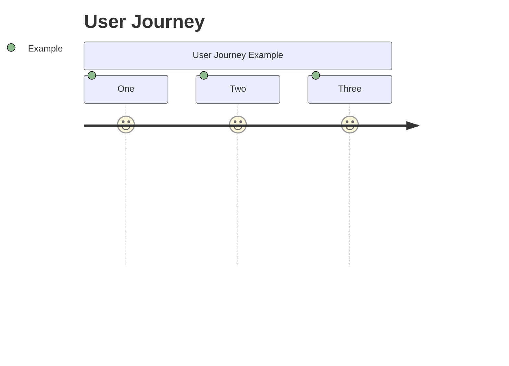
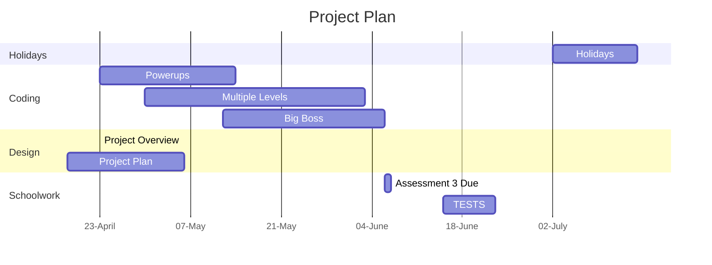

# Project Overview

This game is a clone of the popular game; Space Invaders. The theme of this game is low-quality. There's something appealing about playing something so stupid and low-effort. The entire mobile ad space is currently full of these sort of ads, which seem to be working given this trend's longetivity. I thought I could try to replicate this effect with the graphics.

## The Graphics
Some of these examples of "low effort" graphics include a child's drawing of a rocket as the player sprite and PNGs of aliens digitally modified to make them look low-effort, which ironically took a substantial amount of time.

 

The enemy sprite (left) and the player sprite (right).

## New Gameplay
The additional gameplay that is being included is a big boss enemy, multiple levels and some powerups. It is my hope that this creates a varied and interesting experience for the player, making no two run-throughs of the game the same.

### Powerups
Different powerups include the likes of which include faster fire rate, faster player movement, slower enemy movement and Giga Blast, which clears all the enemies currently on screen. 
In order to make the powerups different every time, there will be a random one spawning every 30 seconds at a random location that the player must get to if they want to obtain it. Hopefully, this will mix up the gameplay from just shooting enemies.

### Multiple levels
There will hopefully be a variety of levels, getting increasingly more and more difficult as the player gets used to the game mechanics. This will culminate in a battle with the big boss.

### Big Boss
The big boss will be a gigantic alien that shoots out sporadic patterns of mini-bullets, instead of predictable larger ones. During this fight, a standard enemy will be on either side of the big boss, shooting at the sides to discourage the player from avoiding the attacks by hiding on the sides of the screen.

# Behaviour - User Journey

# Planning Diagram - Project Plan

